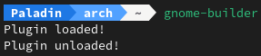

# ValaPlugin
   
Template for creating [GnomeBuilder](https://apps.gnome.org/app/org.gnome.Builder/) plugin using Vala programming language

## Installing
To install your plugin use

    $ meson setup --prefix=~/.local build
    $ ninja -C build install

## Result
